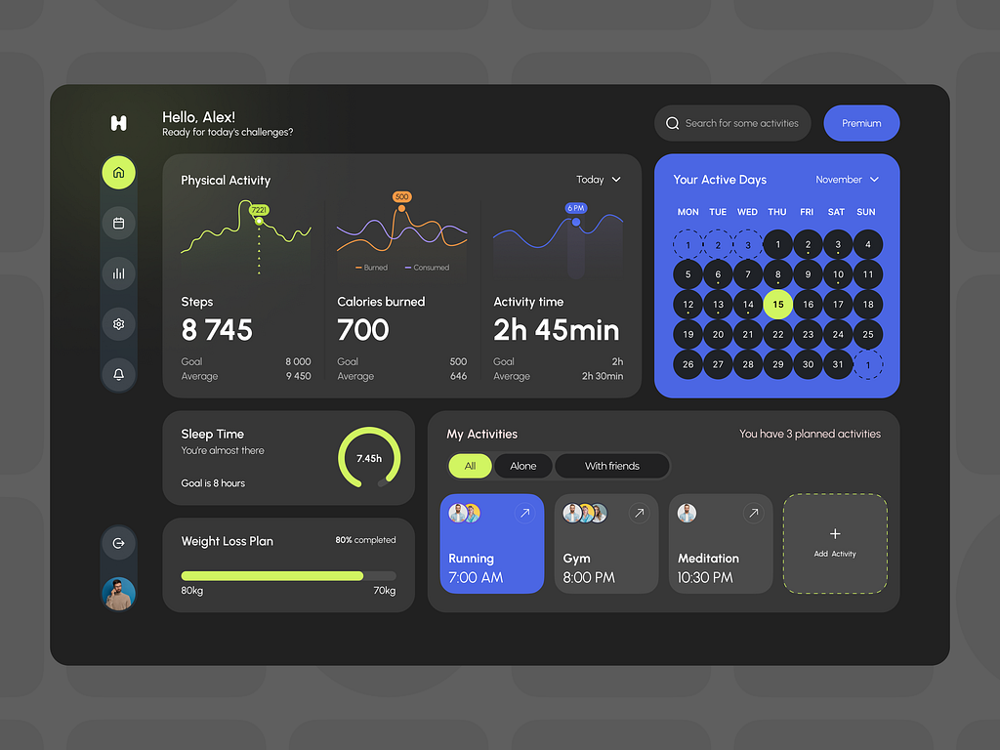

# **Logify - Fitness Tracker Web Application**

Logify is a responsive and modern fitness tracker web application that helps users track their workouts, activities, and goals. It provides a clean, intuitive UI and dynamic features such as workout tracking, activity charts, and progress visualization.


## **Table of Contents**

1. [Features](#features)
2. [Tech Stack](#tech-stack)
3. [Installation](#installation)
4. [Usage](#usage)
5. [File Structure](#file-structure)
6. [Screenshots](#screenshots)
7. [License](#license)

---

## **Features**

- **Dashboard**: A central view with all relevant activity data and stats.
- **Workout Tracker**: Track your workouts with an interactive and responsive UI.
- **Progress Visualization**: Circular and bar charts for tracking progress and goals.
- **Activity Tracker**: Displays active days and fitness streaks.
- **Responsive Design**: Fully optimized for mobile, tablet, and desktop screens.
- **Dark Theme**: Eye-friendly color palette for extended usage.

---

## **Tech Stack**

- **Frontend**:
  - HTML5, CSS3, JavaScript (ES6+)
  - Tailwind CSS
  - Font Awesome (icons)
  - Chart.js (charts and visualizations)

- **Development Tools**:
  - VSCode
  - Node.js and npm
  - Tailwind CLI

---

## **Installation**

### Prerequisites:
- Node.js installed (download it from [Node.js](https://nodejs.org))
- A code editor (e.g., VSCode)

### Steps:
1. Clone the repository:
   ```bash
   git clone https://github.com/your-username/logify.git
   ```
2. Navigate to the project directory:
   ```bash
   cd logify
   ```
3. Install dependencies:
   ```bash
   npm install
   ```
4. Build the Tailwind CSS file:
   ```bash
   npx tailwindcss -i ./src/main.css -o ./dist/output.css --watch
   ```
5. Open `index.html` in your browser to view the app.

---

## **Usage**

1. **Add Workouts**:
   - Use the "Add New" button to create new workout activities.
   - View and edit your activities in real time.

2. **Track Progress**:
   - Visualize your progress with dynamic bar and circular charts.
   - Monitor active days and fitness goals.

3. **Responsive Design**:
   - Open the app on different devices to experience its responsive layout.

---

## **File Structure**

```plaintext
logify/
├── dist/                     # Compiled Tailwind CSS output
│   └── output.css
├── src/                      # Source files
│   └── main.css              # Tailwind CSS input file
├── index.html                # Main HTML file
├── main.js                   # JavaScript logic and Chart.js integrations
├── tailwind.config.js         # Tailwind CSS configuration
├── package.json              # Project dependencies and scripts
└── README.md                 # Project documentation
```

---

## **Screenshots**

### **Dashboard**



## **Acknowledgments**

- Thanks to [Chart.js](https://www.chartjs.org/) for the charting library.
- Tailwind CSS for the utility-first styling framework.

---
